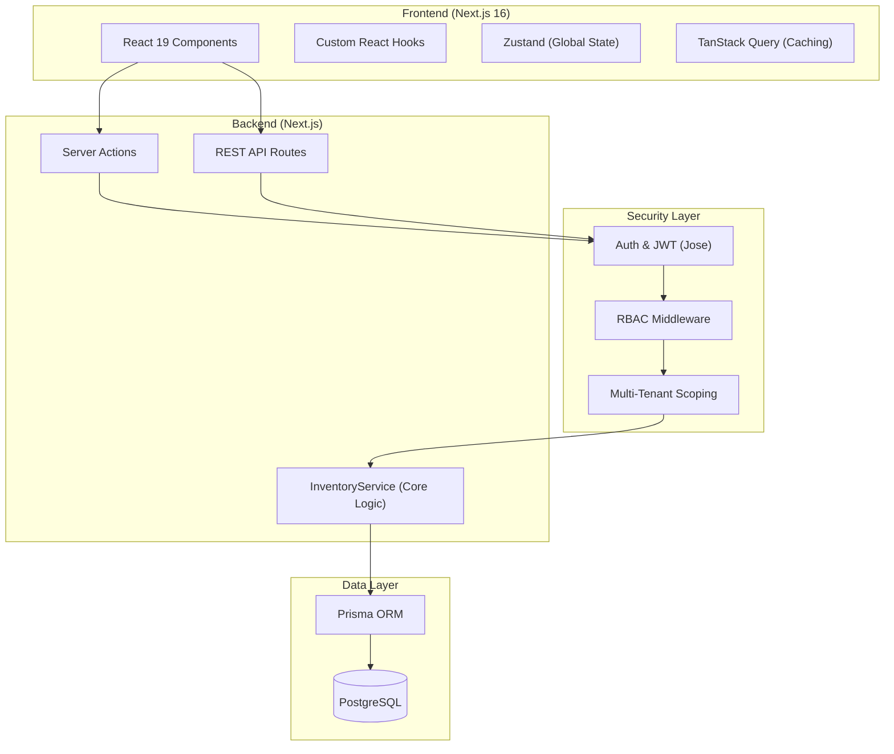
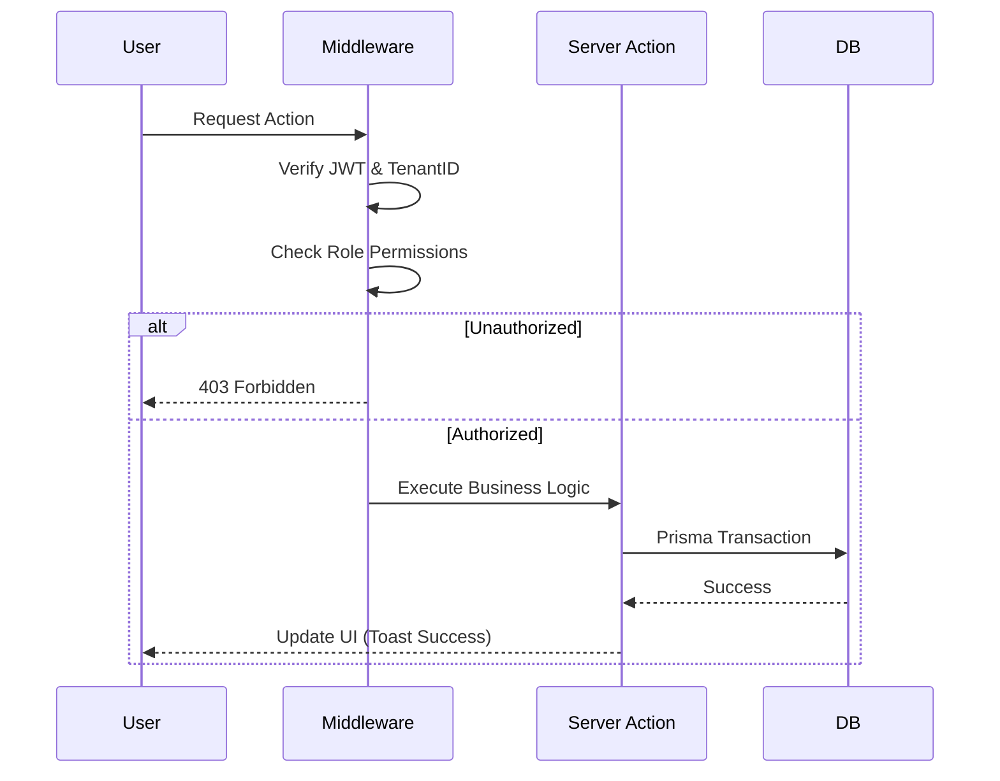
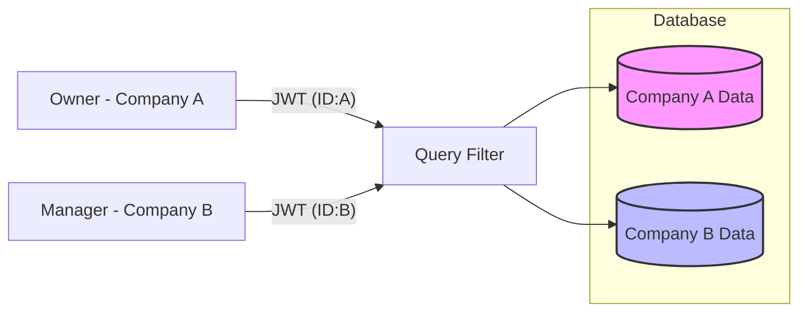
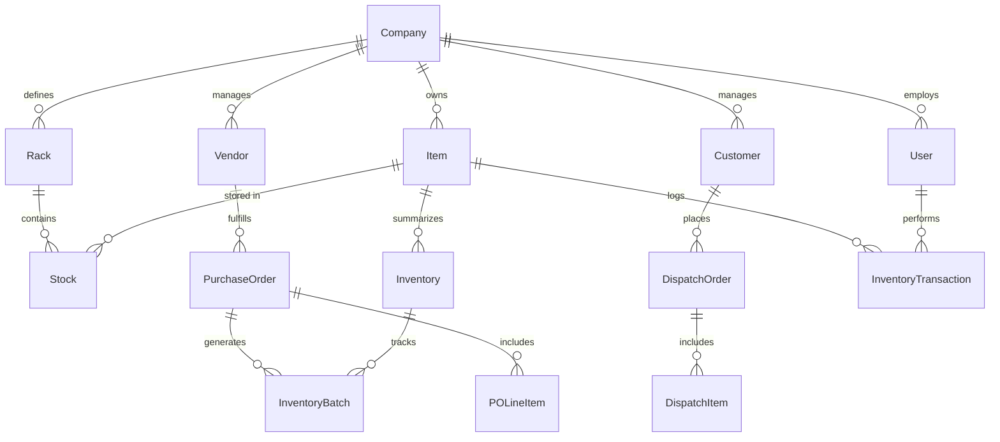
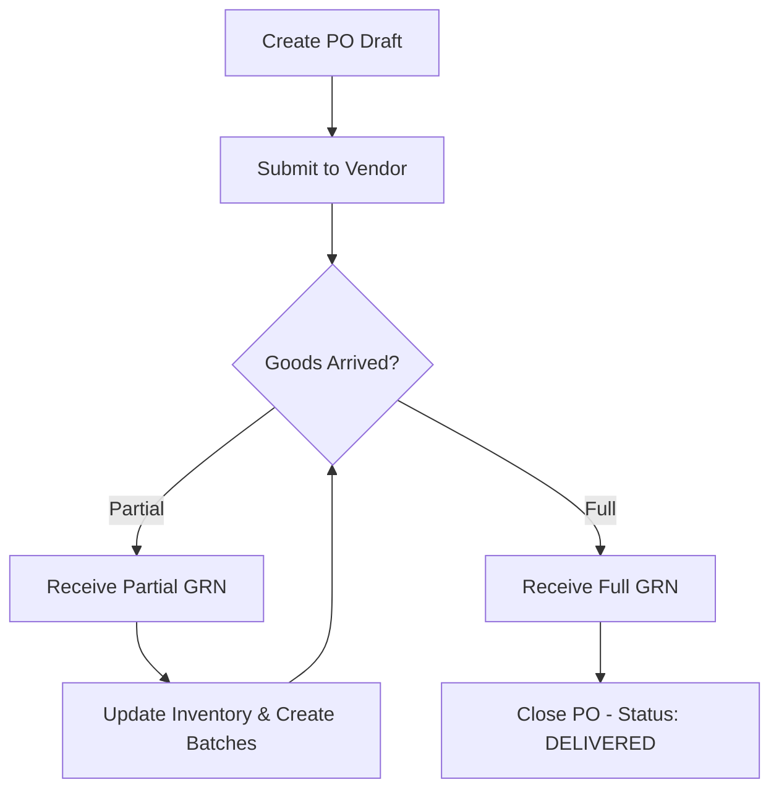
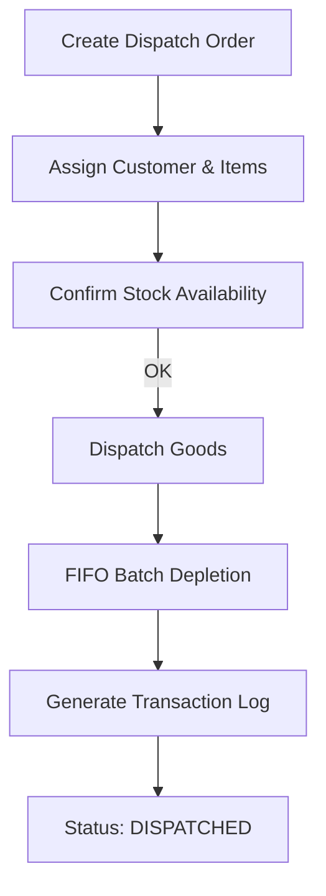
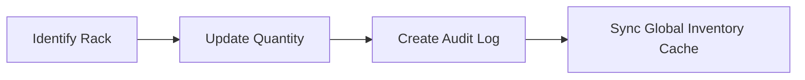

# 📦 IMS: Advanced Multi-Tenant Inventory Management System

A production-grade, high-performance Inventory Management System (IMS) designed for tool inventory and manufacturing workflows. Built with **Next.js 16**, **Prisma 7**, and **PostgreSQL**, it offers robust multi-tenant isolation, granular RBAC, and real-time inventory tracking.

---

## 1. Project Overview
The IMS is a centralized platform for managing complex inventory across multiple independent organizations (tenants). It streamlines the lifecycle of an item—from procurement (Purchase Orders) to warehousing (Rack System) and final distribution (Sales/Dispatch).

**Business Use Cases:**
- **Tool Inventory**: Tracking expensive machinery and consumable tools in manufacturing plants.
- **Warehouse Management**: Organizing stock across physical racks with FIFO (First-In, First-Out) costing.
- **SaaS for Manufacturing**: Providing isolated data environments for different companies like *SS Cuttings* and *Aniket Industries*.

---

## 2. Core Features

### 🛠️ Inventory Management
- **Item Registry**: Comprehensive item metadata (SKU, Category, Units, Critical Levels).
- **Critical Stock Alerts**: Visual indicators for items falling below minimum stock levels.
- **Bulk Actions**: Multi-select support for scrapping inventory or deleting items.

### 📥 Stock Inwards (Purchase Orders)
- **PO Lifecycle**: Manage orders from `DRAFT` to `DELIVERED`.
- **Goods Receipt (GRN)**: Partial or full receipt of items with automated batch creation.
- **Vendor Integration**: Link POs to specific vendors for procurement history.

### 📤 Stock Outwards (Sales Orders)
- **Dispatch Tracking**: Manage customer orders and track dispatch status.
- **FIFO Depletion**: Automated logic to deplete stock from the oldest batches first.
- **Transport Details**: Log transport mode, dispatch person, and collector details.

### 🏗️ Rack & Warehouse System
- **Location Tracking**: Map items to specific physical racks and zones.
- **Manual Adjustments**: Quick stock corrections with mandatory audit logging.
- **VIP Item Handling**: Specialized tracking for high-value or frequently accessed items.

### 📜 Audit & Analytics
- **Activity Logs**: Immutable transaction history for every stock movement.
- **Advanced Filtering**: Filter logs by user, date, item, or transaction type.
- **Data Export**: Download inventory states and transaction reports.

---

## 3. 🧱 System Architecture



---

## 4. 📂 Folder Structure

| Directory | Description |
| :--- | :--- |
| `src/app` | Next.js App Router (Pages, Layouts, Server Actions) |
| `src/app/(dashboard)/orders` | Purchase Orders, Dispatch, and Supply Panels |
| `src/components` | UI components (Dashboard, Forms, Data Tables) |
| `src/lib` | Core business logic (`InventoryService`), Auth, and Prisma Client |
| `src/hooks` | Reusable React hooks for data fetching and UI state |
| `src/config` | Global constants, navigation menu items, and UI themes |
| `prisma` | Database schema (`schema.prisma`) and seed scripts |
| `scripts` | Maintenance and backfill scripts |

---

## 5. ⚙️ Setup Instructions

### Prerequisites
- Node.js 18+
- PostgreSQL Instance

### Installation
1. **Clone & Install:**
   ```bash
   git clone <repo-url>
   cd ims
   npm install
   ```

2. **Environment Setup:**
   Create a `.env` file from the example:
   ```bash
   cp .env.example .env
   ```
   *Fill in `DATABASE_URL` and `JWT_SECRET`.*

3. **Database Initialization:**
   ```bash
   npx prisma generate
   npx prisma db push
   npm run seed
   ```

4. **Run Development Server:**
   ```bash
   npm run dev
   ```

---

## 6. 🔐 RBAC Design (Role-Based Access Control)

The system uses a granular permission matrix assigned to three primary roles.

### Permission Matrix

| Feature | Owner | Manager | Employee |
| :--- | :---: | :---: | :---: |
| Company Settings | ✅ | ❌ | ❌ |
| User Management | ✅ | ❌ | ❌ |
| Item CRUD | ✅ | ✅ | ❌ |
| Stock Adjustment | ✅ | ✅ | ✅ (Limited) |
| PO Management | ✅ | ✅ | 👁️ (View Only) |
| Sales/Dispatch | ✅ | ✅ | ✅ |
| Activity Logs | ✅ | ✅ | 👁️ (View Only) |

### Authorization Flow



---

## 7. 🏢 Multi-Tenant Architecture

Every record in the database is scoped to a `companyId`. Users can only access data belonging to their session's company.

### Isolation Strategy
- **Logical Isolation**: A single database shared across tenants, but every query includes a mandatory `where: { companyId: session.companyId }`.
- **Session Scoping**: The `companyId` is baked into the encrypted JWT session.



---

## 8. 🗄️ Database Schema (ER Diagram)



---

## 9. 🔄 Core Workflows

### a) Purchase Order (Procurement)


### b) Sales & Dispatch


### c) Stock Movement (Manual)


---

## 10. 🔌 API & Server Actions Overview

The system uses a hybrid approach with **Server Actions** for form submissions and **REST API Routes** for data fetching and integrations.

### Key REST Endpoints

| Endpoint | Method | Description |
| :--- | :--- | :--- |
| `/api/inventory` | `GET` | Fetch global inventory levels |
| `/api/items` | `GET/POST` | Manage item registry |
| `/api/purchase-orders` | `GET/POST` | Procurements and GRN processing |
| `/api/dispatch-orders` | `GET/POST` | Sales and shipping management |
| `/api/supply-outwards` | `GET` | Real-time dispatched items panel |
| `/api/transactions` | `GET` | Activity logs with advanced filtering |
| `/api/reports` | `GET` | Analytics data for dashboards |

### Core Service Logic (`src/lib/inventory-service.ts`)

- `addItem()`: Registers new items with initial registry log.
- `receiveGoods()`: Complex transaction handling PO receipts and batching.
- `dispatchGoods()`: Handles sales, rack deduction, and FIFO batch depletion.
- `updateStock()`: Performs manual adjustments with inventory synchronization.
- `bulkScrapInventory()`: Efficiently scraps multiple items in a single transaction.

---

## 11. 📱 UI/UX Notes
- **Responsive Sidebar**: Collapsible sidebar optimized for both desktop and tablet views.
- **Glassmorphism Panels**: Modern UI aesthetics using semi-transparent cards.
- **Supply-Outwards Panel**: A unified command center for tracking both "Booked Items" (pending orders) and "Recent Dispatches" (sales transactions). Features a real-time Bento-style stats grid for quick KPIs.
- **Supply-Inwards Panel**: Streamlined interface for receiving goods and managing incoming inventory batches.
- **Keyboard Shortcuts**: Global command palette (Cmd/Ctrl + K) for rapid navigation.

---

## 12. 🚀 Deployment

1. **Vercel Deployment**: 
   - Connect the repo to Vercel.
   - Configure Environment Variables.
   - Ensure `npm run build` runs `prisma generate`.
2. **Database Migration**:
   - Vercel deployments automatically run `prisma migrate deploy` via the build script.

*See [DEPLOYMENT.md](./DEPLOYMENT.md) for advanced Docker & CI/CD configurations.*

---

## 13. 🔮 Future Improvements
- **SaaS Billing**: Integration with Stripe for company-tier subscriptions.
- **Advanced Analytics**: Predictive stock-out warnings using historical velocity.
- **Real-time Notifications**: Webhooks and Email/SMS alerts for critical stock events.
- **Mobile App**: Dedicated React Native app for warehouse scanning.
---
*Internal Property of SS Cuttings / Aniket Industries. All Rights Reserved.*
